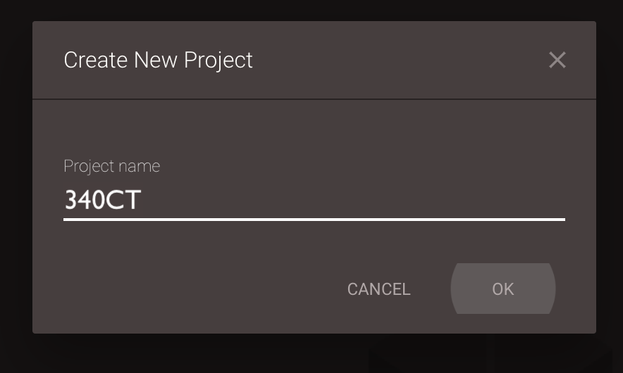
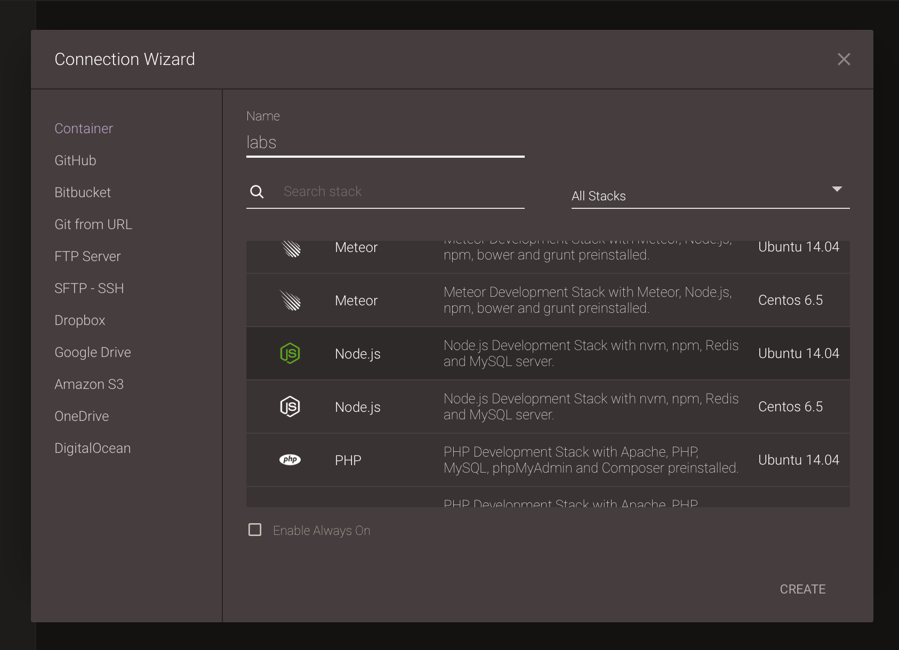
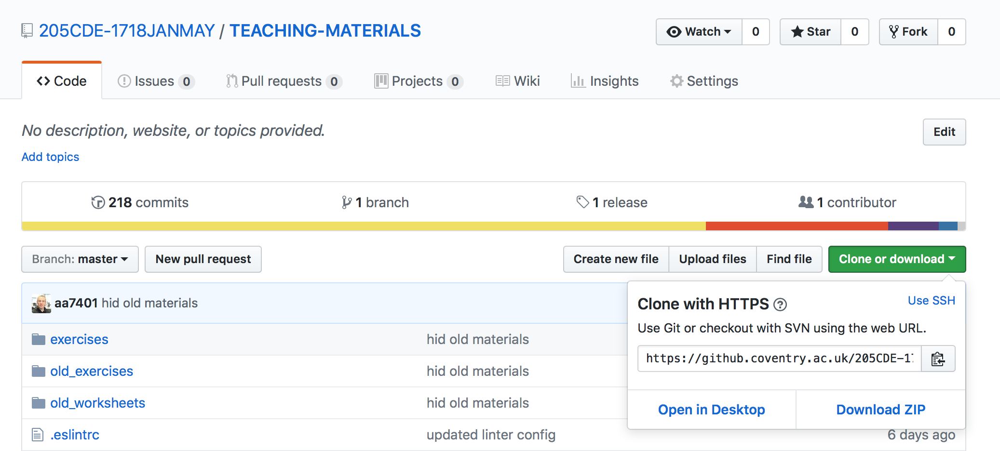
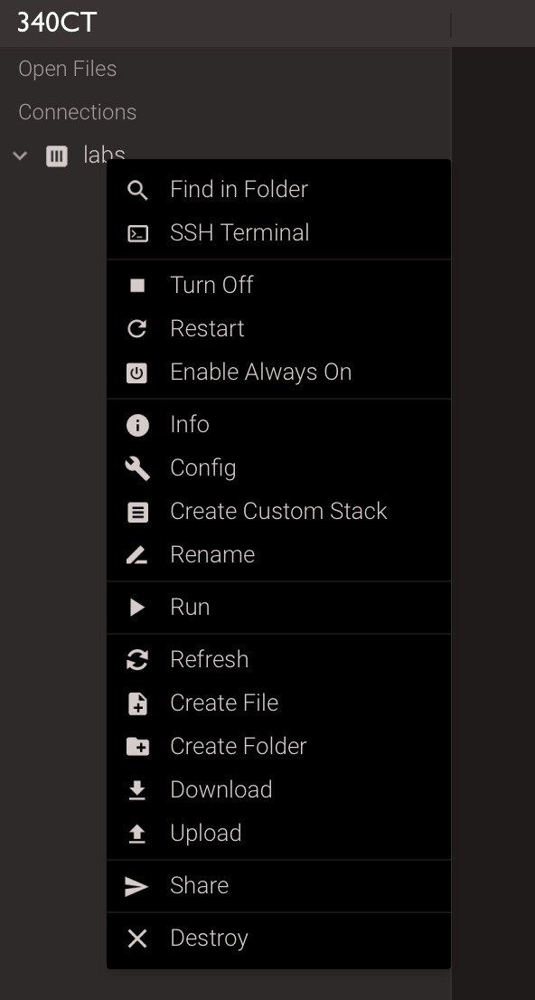
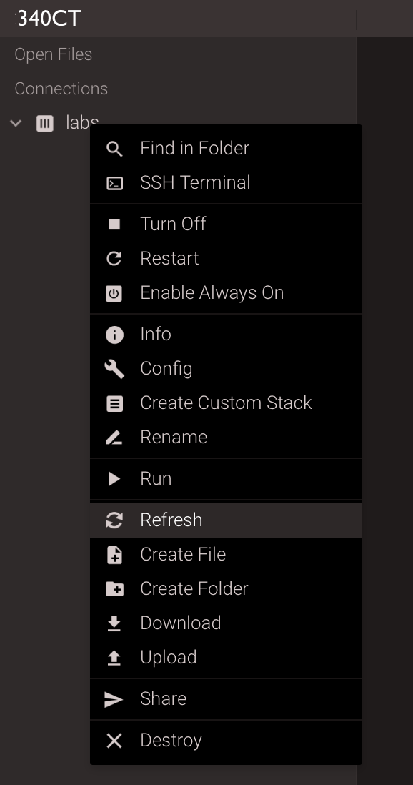
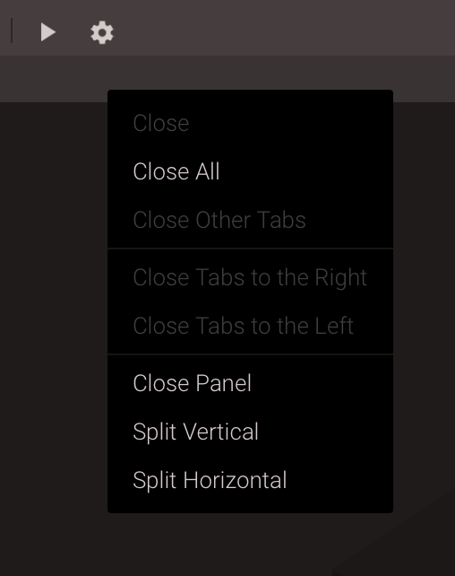
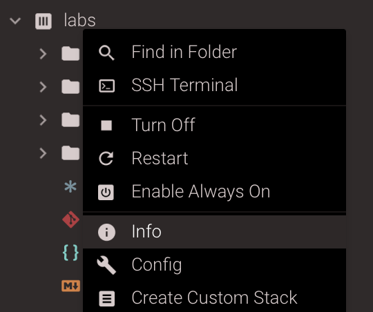

# Setup

Welcome to the first worksheet. In it you will be setting up your development environment using the Codeanywhere online IDE and running your first (static) website.

## Codeanywhere

The first step is to configure the Codeanywhere IDE. Go the the [Codeanywhere website](https://codeanywhere.com) and log in. You may need to create an account first.

Now you need to create a new **Project** by accessing the _File_ menu as shown.


Next you will be prompted to create a new project. Give it the name `205CDE`.



Finally you will need to add a new **Container**. You should add the _NodeJS_ container running under _Ubuntu_ as shown. Give it the name `labs`.



You now have an Ubuntu development environment running NodeJS.

## 2 Cloning the Lab Materials

Now we have to _clone_ the repository containing the lab materials. Start by opening the [TEACHING_MATERIALS](https://github.coventry.ac.uk/340CT-1819SEPJAN/TEACHING-MATERIALS) repository on GitHub.

Click on the green **Download** button as shown and then copy this URL to the clipboard.



Now we need to use the **Terminal** that is built into Codeanywhere. If one is not open you can _right-click_ on the container in the sidebar (called `labs`) and choose the **SSH Terminal** option from the dropdown menu.



Please note you will have to type the following to clone the repository (CTRL+V/paste does not work). Remember to include the entire repository URL and don't forget the `labs` at the end.

```shell
$ git clone https://.../TEACHING-MATERIALS.git labs
  Cloning into '.'...
  remote: Counting objects: 1692, done.
  remote: Compressing objects: 100% (102/102), done.
  remote: Total 1692 (delta 26), reused 109 (delta 18), pack-reused 1572
  Receiving objects: 100% (1692/1692), 13.82 MiB | 918.00 KiB/s, done.
  Resolving deltas: 100% (690/690), done.
  Checking connectivity... done.
```

This will have created a directory called `foundation/` and cloned all of the files in this repository into it. Right-click on the `labs` container again and choose `refresh` to reload the sidebar and this should display the files.



## Arranging the IDE

The final step before running your first website is to organise the windows of the IDE. Right-click on the _tab bar_ as shown and choose **Split Horizontal** from the context menu as shown.



Now select the bottom pane then open the SSH Terminal. By selecting the bottom pane first you are telling Codeanywhere that is where the window should open.

If you now open the `TEACHING-MATERIALS/exercises/01_setup/index.js` file you will see this also opens in the bottom pane. We want it at the top so drag its tab to the top tab bar.

Finally you can drag the divider down a bit to make the top pane larger. The final result should look a like this:


You are now ready to start your lab exercises.

## Hello World

Your first task is to check that everything is correctly configured by running a _hello world_ exercise.

Use the SSH Terminal to navigate to the `TEACHING-MATERIALS/exercises/01_setup/` directory.

REMEMBER: to change directory use the command:                    $cd
          to list files in a directory use the command:           $ls
          to navigate to the previous directory use the command:  $cd ..

```shell
$ cd TEACHING-MATERIALS/exercises/01_setup/
$ ls
```

Now we will try to run the `index.js` script.

```shell
$ node index.js
  module.js:544
    throw err;
    ^
  Error: Cannot find module 'express'
```

Notice we get an error! if you study the `index.js` file you will see that on line 4 we import a module called `express` but this has not been installed.

```shell
$ npm install express
$ node index.js
  app listening on port 8080
```

Now the script is running on port 8080, its time to view the web page. Right-click on the `labs` container and choose the **Info** option.


This will display some useful information which we will need. You are looking for the URL of your container (this will NOT be the same as that shown in the screenshot.)



Now open a new browser tab and paste in this URL, adding the correct port number that our script is running on. For my example the URL is `http://labs-marktyers842735.codeanyapp.com:8080`. If everything is working correctly you should see the text `hello world` in the browser.

## Editing the Output

Lets try changing the displayed message. We need to stop the script. Select the SSH Terminal and press `ctrl+c` which will return you to the shell prompt.

Now edit the message (`index.js`, line 11) so it will display your name. REMEMBER to save the changes to index.js. Restart the script ($node index.js) and then refresh your browser window.