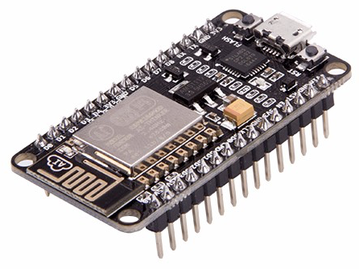

# The Sensor Module

Congratulations, you have been assigned to develop the sensor module for this project. You will need to apply the skills you have learned on the CHSE programme, on the 307CR module or through your personal learning.

Your task is to build a prototype IoT module that captures data from one or more sensors, cleans this and sends it through to the API being developed by the rest of your team. To be able to complete this work you need:

- familiarity with electronic circuits:
  - Analog circuits
  - The I2C serial bus
  - Serial communication
- familiarity with the Arduino platform:
  - Working with the IDE
  - building Arduino Libraries
- familiarity with the C++ programming language

As well as being able to build circuits with microcontrollers, you should also be able to:

- Create Arduino (C++) libraries.
- Write C++ unit tests and generate code coverage reports.
- Be familiar with Git and GitHub (stage(`add`), `commit`, `push`, `pull`).

Make sure you configure your laptop correctly and be ready to start writing the app in **week 4**. If you are not completely comfortable with any of the skills listed above you have between now and week 4 to resolve this.

## The Microcontroller

The core of your sensor module will be based around the [ESP8266](https://en.wikipedia.org/wiki/ESP8266) Wifi chip with self-contained microcontroller. This is the most commonly-used chip in Internet of Things (IoT) devices.

You will be provided with an **ESP8266 Development Module**.

 Whilst it comes with its own Software Development Kit (SDK) based around freeRTOS, there are a number of more popular options:

- NodeMCU (based around the Lua programming language).
- MicroPython
- Arduino

## Sensors

There are a number of sensors that can be used for environmental sensors but it is important that you only pick those that are supported by Arduino libraries. The table below shows some of the most useful ones and includes links to online tutorials. If you identify other useful ones, let the module leader know and they can be added to the list.

| Environment                              | Sensor       | Tutorial              |
| ---------------------------------------- | ------------ | --------------------- |
| Temperature                              | DS18B20      | https://goo.gl/aNBgtK |
| Temperature and humidity                 | DHT11        | https://goo.gl/xdoFG6 |
| NH3,NOx, alcohol, Benzene, smoke, CO2    | MQ-135       | https://goo.gl/zxCetD |
| Hygrometer                               | YL-69        | -                     |
| UV                                       | GUVA-S12SD   | https://goo.gl/3s6J4o |
| Light                                    | TSL2561      | https://goo.gl/YUftqv |
| Dust                                     | GP2Y1010AU0F | https://goo.gl/MTNiyf |
| Dust                                     | DSM501A      | -                     |
| Vibration                                | SW-420       | https://goo.gl/4tNLi5 |
| Sound                                    | KY-038       | https://goo.gl/bCxrXF |
| Combustible Gas, Smoke                   | MQ-2         | https://goo.gl/2fBk1t |
| Alcohol gas                              | MQ-3         | -                     |
| CH4 / Natural gas                        | MQ-4         | -                     |
| LPG, Natural Gas, Town Gas               | MQ-5 MQ-6    | -                     |
| CO (carbon monoxide)                     | MQ-7         | -                     |
| Hydrogen                                 | MQ-8         | -                     |
| Carbon Monoxide, Coal Gas, Liquefied Gas | MQ-9         | -                     |

## Equipment List

**You will be provided with kit** to use in the lab sessions but you may wish to purchase your own, below you can find a full costed kit. Prices and links are for Amazon but you can find these a lot cheaper if you shop around and you may be able to find some of this kit in the electronics lab (ask the supervisor in the lab first).

| Equipment                                                   | Cost  |
| ----------------------------------------------------------- | ----- |
| [NodeMCU ESP8266 CP2102 v3](http://amzn.eu/iFhW1f4)         | £6.99 |
| [USB type-c to Micro-b 15cm cable](http://amzn.eu/0EwGYjA)  | £5.51 |
| [Micro-USB cable 30cm](http://amzn.eu/eJ6z1Ux)              | £3.99 |
| [Breadboard with power supply](http://amzn.eu/6R8H6Oi)      | £8.38 |
| [Jumper wires x130](http://amzn.eu/buVG3Wk)                 | £5.99 |
| [Rechargable 9v battery](http://amzn.eu/6kKladh)            | £5.78 |
| [Temperature sensor module DS18B20](http://amzn.eu/6h2mzBC) | £1.35 |
| [Temperature/Humidity module DHT11](http://amzn.eu/glrhIqs) | £1.46 |
| [Gas sensor MQ-135](http://amzn.eu/h573jLl)                 | £5.60 |
| [UV sensor KS-204 GUVA-S12SD](http://amzn.eu/5KNJy0x)       | £5.29 |
| [Light sensor GY-2561 TSL2561](http://amzn.eu/a07k83G)      | £1.62 |
| [Vibration sensor SW-420](http://amzn.eu/crleUBd)           | £1.76 |
| [Sound sensor KY-038](http://amzn.eu/3tkqZG2)               | £3.60 |
| [Dust sensor GP2Y1010AU0F](http://amzn.eu/5xqZT1y)          | £8.76 |
| [GY-NEO6MV2 NEO-6M GPS Module](http://amzn.eu/j07kOl8)      | £5.99 |
| [Stanley storage box](http://amzn.eu/hyI4x9J)               | £7.30 |

## Connecting to the API

Whatever data you collect will need to be passed to the API developed by the rest of your team. This data will be transmitted over the WiFI network using the built-in WiFi on the NodeMCU board. There are two protocols you can use for this:

- REST
- MQTT

You together with your team will need to decide on which protocol to use. To help you with this you should try connecting to some existing IoT APIs which utilise both protocols:

- [Adafruit](https://io.adafruit.com)
- [Thinger](https://console.thinger.io)
