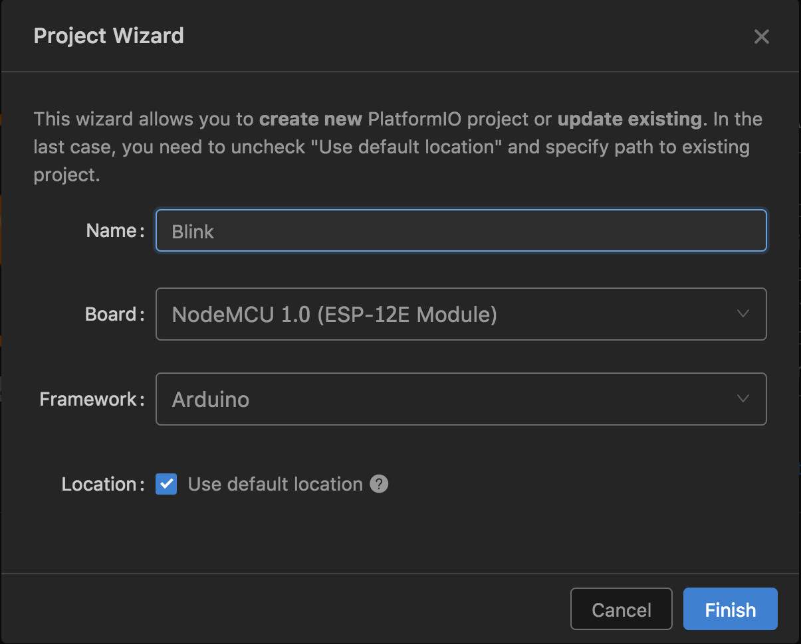

# Configuring The IoT Editor

Install [Visual Studio Code](https://code.visualstudio.com) and then install the [PlatformIO](https://platformio.org) plugin. This can take some time!

Once installed you will need to restart VS Code. After restarting you will see the **PlatformIO Home** icon in the blue **Status Bar**. If the bar is not visible you can fix this using the _View > Show Status Bar_ menu. Clicking on this brings up the **PIO Home** screen and displays the **PlatformIO Toolbar** at the bottom of the IDE. This contains a number of important buttons:


1. Home
2. Build
3. Upload
4. Upload to remote device
5. Clean
6. Test
7. Run task
8. Serial monitor

Locate the **New Project** button on the **PIO Home** screen and click it to launch the wizard.



You should give your project a title (Blink). For the board use the dropdown list to select the **NodeMCU 1.0 (ESP-12E Module)** and make sure the **Arduino** framework is selected. There is a default location for the project files but if you uncheck the **Location** checkbox you can choose where to save the project.

If you open the explorer tab in VSCode (the first icon down the left of the editor) you can see that PlatformIO has created a series of directories and files:

```
.
├── lib
│   └── readme.txt
├── platformio.ini
└── src
    └── main.cpp
```

The project files should be saved in the `src/` directory and any project-specific libraries need to be in separate directories in the `lib/` directory.

Open the `src/main.cpp` file and replace its contents with the following:

``cpp
#include "Arduino.h"

#define LED_BUILTIN 2

void setup() {
  // initialize LED digital pin as an output.
  pinMode(LED_BUILTIN, OUTPUT);
}

void loop() {
  digitalWrite(LED_BUILTIN, HIGH);
  delay(1000);
  digitalWrite(LED_BUILTIN, LOW);
  delay(1000);
}
``

Plug in your ESP8266, click on the **Build** button. Once the code is compiled and linked click on the **Upload** button to upload the hex file to the microcontroller. This should result in the onboard LED flashing on and off.

## 2 Unit Testing
